# 3Tier-Deploy-Using-Terraform

## 📑 Table of Contents
- [Overview](#-overview)
- [Architecture Setup](#architecture-setup)
- [Terraform Structure](#terraform-structure)
- [Configuration Steps](#configuration-steps)
  - [Frontend EC2 (Boot-time Setup)](#frontend-ec2)
  - [Backend EC2 (Boot-time Setup)](#backend-ec2)
  - [Database EC2 (Boot-time Setup)](#database-ec2)
- [Screenshots](#-screenshots)
- [Architecture Diagram](#architecture-diagram)
- [Security Group Relationships](#-security-group-relationships)


## 📖 Overview
This project demonstrates deploying a full-stack Team Directory Application using Infrastructure as Code (Terraform) on AWS EC2.

- **Presentation Layer (Frontend)** → Static HTML/CSS/JS served via Nginx (Public EC2)
- **Application Layer (Backend)** → Node.js (Raw HTTP) API managed by PM2 (Private EC2)
- **Data Layer (Database)** →  MySQL Server (Private EC2)
- **Management Layer** →  Bastion Host for secure SSH access.

---

## 🧱 Architecture Setup
The infrastructure is fully defined in Terraform, creating a secure 3-tier architecture.
- **Frontend EC2 (Public Subnet)**  
  - Serves the frontend UI via Nginx.
  - Proxies /api requests to the Backend EC2.
- **Backend EC2 (Private Subnet)**  
  - Runs a Node.js API on port 8080.
  - Managed by PM2 for process management.
  - Connects to the Database EC2.
- **Database EC2 (Private Subnet)**  
  - Runs MySQL Server.
  - Accessible only from the Backend Security Group.
- **Bastion Host (Public Subnet)**  
  - Acts as a Jump Host to access Private EC2s securely.

### AWS Networking
- **VPC** with subnets:
  - Public Subnets → Frontend EC2 & Bastion Host.
  - Private App Subnet → Backend EC2.
  - Private DB Subnet → Database EC2.
- **Routing**:
  - Public Subnets → Internet Gateway (Direct Internet Access).
  - Private Subnets → NAT Gateway (Outbound Internet Access for updates/installs). 
- **Security Groups**:
  - Frontend SG → inbound 80/443 from `0.0.0.0/0`
  - Backend SG → Allow 8080 only from Frontend SG & Bastion SG.
  - DB SG → Allow 3306 only from Backend SG.
  - Bastion SG → Allow 22 from your IP (or restricted range).

---

## ⚙️ Terraform Structure

.
├── main.tf                 # Root module calling sub-modules
├── outputs.tf              # IPs and Ids
├── providers.tf            # Terraform and AWS
├── variables.tf            # Input variables ( Key names )
├── modules/
│   ├── network/            # VPC, Subnets, IGW, NAT, Route Tables
│   ├── security/           # Security Groups (Public, Private, DB)
│   └── compute/            # EC2 Instances (Bastion, Frontend, Backend, DB)
└── scripts/
    ├── frontend_userdata.sh # Script to setup Frontend
    └── backend_userdata.sh  # Script to setup Backend

---

## 🛠️ Configuration Steps

### Frontend EC2 (Boot Time Setup)
```bash
#!/bin/bash
set -euo pipefail
exec > >(tee /var/log/userdata-frontend.log | logger -t userdata -s 2>/dev/console) 2>&1

echo "===== [nt-frontend] Initialization Start ====="

# ── System packages ───────────────────────────────────────────
apt-get update -y
apt-get install -y nginx curl

# ── Write the frontend HTML app ───────────────────────────────
mkdir -p /var/www/html/app

cat > /var/www/html/app/index.html << 'HTMLAPP'
<!DOCTYPE html>
<html lang="en">
<head>
  <meta charset="UTF-8" />
  <meta name="viewport" content="width=device-width, initial-scale=1.0"/>
  <title>Team Directory</title>
  <style>
    * { box-sizing: border-box; margin: 0; padding: 0; }
    body { font-family: 'Segoe UI', system-ui, sans-serif; background: #0f172a; color: #e2e8f0; min-height: 100vh; padding: 2rem; }
    header { text-align: center; margin-bottom: 3rem; }
    header h1 { font-size: 2.5rem; font-weight: 700; background: linear-gradient(135deg, #38bdf8, #818cf8); -webkit-background-clip: text; -webkit-text-fill-color: transparent; background-clip: text; }
    header p { color: #64748b; margin-top: 0.5rem; }
    #status { text-align: center; padding: 1rem; border-radius: 8px; margin-bottom: 1.5rem; font-size: 0.9rem; display: none; }
    #status.error   { background: #450a0a; color: #fca5a5; display: block; }
    #status.loading { background: #172554; color: #93c5fd; display: block; }
    #grid { display: grid; grid-template-columns: repeat(auto-fill, minmax(260px, 1fr)); gap: 1.25rem; max-width: 1100px; margin: 0 auto; }
    .card { background: #1e293b; border: 1px solid #334155; border-radius: 12px; padding: 1.5rem; transition: transform 0.2s, border-color 0.2s; }
    .card:hover { transform: translateY(-4px); border-color: #38bdf8; }
    .avatar { width: 52px; height: 52px; border-radius: 50%; display: flex; align-items: center; justify-content: center; font-size: 1.4rem; font-weight: 700; margin-bottom: 1rem; background: linear-gradient(135deg, #0ea5e9, #6366f1); color: #fff; }
    .card h2 { font-size: 1.1rem; font-weight: 600; color: #f1f5f9; }
    .role { font-size: 0.82rem; color: #38bdf8; margin: 0.25rem 0 0.75rem; text-transform: uppercase; letter-spacing: 0.05em; }
    .dept { font-size: 0.85rem; color: #94a3b8; }
    .joined { font-size: 0.78rem; color: #475569; margin-top: 0.5rem; }
    .tag { display: inline-block; background: #0f172a; border: 1px solid #334155; color: #94a3b8; font-size: 0.75rem; padding: 0.2rem 0.6rem; border-radius: 999px; margin-top: 0.75rem; }
    #meta { text-align: center; color: #334155; font-size: 0.78rem; margin-top: 2.5rem; }
  </style>
</head>
<body>
<header>
  <h1>Team Directory</h1>
  <p>Live data pulled from Database MySQL via Node.js API</p>
</header>
<div id="status" class="loading">Fetching data...</div>
<div id="grid"></div>
<div id="meta"></div>
<script>
  async function load() {
    const status = document.getElementById('status');
    const grid   = document.getElementById('grid');
    const meta   = document.getElementById('meta');
    status.className = 'loading'; status.textContent = 'Fetching team data from API...'; status.style.display = 'block';
    try {
      const res  = await fetch('/api/members');
      if (!res.ok) throw new Error('HTTP ' + res.status);
      const data = await res.json();
      status.style.display = 'none';
      data.members.forEach(m => {
        const initials = m.name.split(' ').map(w=>w[0]).join('').slice(0,2).toUpperCase();
        grid.innerHTML += '<div class="card"><div class="avatar">'+initials+'</div><h2>'+m.name+'</h2><div class="role">'+m.role+'</div><div class="dept">'+m.department+'</div><div class="joined">Joined '+new Date(m.joined_at).toLocaleDateString('en-US',{year:'numeric',month:'short'})+'</div><span class="tag">'+m.location+'</span></div>';
      });
      meta.textContent = data.members.length+' members loaded from '+data.source+' in '+data.query_ms+'ms';
    } catch(e) {
      status.className = 'error'; status.textContent = 'Error: '+e.message;
    }
  }
  load();
</script>
</body>
</html>
HTMLAPP

# ── Nginx config: serve app + proxy /api to backend ──────────
cat > /etc/nginx/sites-available/nt-app << NGINXCONF
server {
    listen 80;
    server_name _;

    root /var/www/html/app;
    index index.html;

    # Serve frontend SPA
    location / {
        try_files \$uri \$uri/ /index.html;
    }

    # Proxy all /api/* calls to backend Node.js
    location /api/ {
        proxy_pass         http://${backend_private_ip}:8080;
        proxy_http_version 1.1;
        proxy_set_header   Host              \$host;
        proxy_set_header   X-Real-IP         \$remote_addr;
        proxy_set_header   X-Forwarded-For   \$proxy_add_x_forwarded_for;
        proxy_set_header   X-Forwarded-Proto \$scheme;
        proxy_connect_timeout 30s;
        proxy_read_timeout    30s;
    }

    access_log /var/log/nginx/nt-app-access.log;
    error_log  /var/log/nginx/nt-app-error.log;
}
NGINXCONF

ln -sf /etc/nginx/sites-available/nt-app /etc/nginx/sites-enabled/nt-app
rm -f /etc/nginx/sites-enabled/default

nginx -t   # Validate config before restarting

systemctl enable nginx
systemctl restart nginx

hostnamectl set-hostname ${project_name}-frontend
echo "===== [nt-frontend] Init Complete ====="
echo "Backend proxied at: http://${backend_private_ip}:8080"

```

### NGINX Conf File
```bash
server {
    listen 80;
    server_name _;

    root /var/www/html/app;
    index index.html;

    # Serve frontend SPA
    location / {
        try_files \$uri \$uri/ /index.html;
    }

    # Proxy all /api/* calls to backend Node.js
    location /api/ {
        proxy_pass         http://${backend_private_ip}:8080;
        proxy_http_version 1.1;
        proxy_set_header   Host              \$host;
        proxy_set_header   X-Real-IP         \$remote_addr;
        proxy_set_header   X-Forwarded-For   \$proxy_add_x_forwarded_for;
        proxy_set_header   X-Forwarded-Proto \$scheme;
        proxy_connect_timeout 30s;
        proxy_read_timeout    30s;
    }

    access_log /var/log/nginx/nt-app-access.log;
    error_log  /var/log/nginx/nt-app-error.log;
}
```

### Backend EC2 (Boot Time Setup)

```bash
#!/bin/bash

exec > >(tee /var/log/userdata-backend.log | logger -t userdata -s 2>/dev/console) 2>&1

echo "===== [nt-backend] Initialization Start ====="


echo "[Network] Waiting for connectivity to package repositories..."
for i in {1..40}; do
  if apt-get update -qq > /dev/null 2>&1; then
    echo "[Network] Connection established."
    break
  fi
  echo "[Network] Not ready yet... waiting 10s (Attempt $i/20)"
  sleep 10
done

# ── System packages ───────────────────────────────────────────
apt-get update -y
apt-get install -y git curl build-essential mysql-client

# ── Node.js 18 via NVM ────────────────────────────────────────
mkdir -p /root/.nvm
export NVM_DIR="/root/.nvm"
curl -o- https://raw.githubusercontent.com/nvm-sh/nvm/v0.39.7/install.sh | bash

if [ ! -s "$NVM_DIR/nvm.sh" ]; then
  echo "ERROR: NVM installation failed. Script exiting."
  exit 1
fi
echo "[Step 2/5] Loading NVM..."
[ -s "$NVM_DIR/nvm.sh" ] && . "$NVM_DIR/nvm.sh"
# [ -s "$NVM_DIR/bash_completion" ] && \. "$NVM_DIR/bash_completion"
# source ~/.bashrc

# ── CRITICAL FIX: Export PATH for PM2 and NPM ─────────────────

nvm install 18 && nvm use 18 && nvm alias default 18
export PATH=$NVM_DIR/versions/node/$(nvm current)/bin:$PATH

# ── PM2 process manager ───────────────────────────────────────
npm install -g pm2
npm install dotenv

# ── App directories ───────────────────────────────────────────
mkdir -p /var/app/backend
mkdir -p /var/log/app
chown -R root:root /var/app/backend /var/log/app

# ── Write package.json (Includes dotenv) ──────────────────────
cat > /var/app/backend/package.json << 'PKGJSON'
{
  "name": "nt-backend",
  "version": "1.0.0",
  "main": "server.js",
  "scripts": { "start": "node server.js" },
  "dependencies": { 
    "mysql2": "^3.9.7",
    "dotenv": "^16.4.5" 
  }
}
PKGJSON

# ── Write .env ────────────────────────────────────────────────
cat > /var/app/backend/.env << ENVFILE
NODE_ENV=production
PORT=8080
DB_HOST=${db_endpoint}
DB_PORT=${db_port}
DB_NAME=${db_name}
DB_USER=${db_username}
DB_PASSWORD=${db_password}
ENVFILE
chmod 600 /var/app/backend/.env

# ── Write server.js (Includes dotenv config) ───────────────────
cat > /var/app/backend/server.js << 'SERVERJS'
require('dotenv').config();
'use strict';

const http  = require('http');
const mysql = require('mysql2/promise');

const PORT    = process.env.PORT     || 8080;
const DB_HOST = process.env.DB_HOST;
const DB_PORT = parseInt(process.env.DB_PORT || '3306', 10);
const DB_NAME = process.env.DB_NAME;
const DB_USER = process.env.DB_USER;
const DB_PASS = process.env.DB_PASSWORD;

let pool;

async function getPool() {
  if (!pool) {
    pool = mysql.createPool({
      host: DB_HOST, port: DB_PORT, database: DB_NAME,
      user: DB_USER, password: DB_PASS,
      waitForConnections: true, connectionLimit: 10,
    });
    await seedIfEmpty(pool);
  }
  return pool;
}

async function seedIfEmpty(pool) {
  await pool.execute(`
    CREATE TABLE IF NOT EXISTS members (
      id         INT AUTO_INCREMENT PRIMARY KEY,
      name       VARCHAR(100) NOT NULL,
      role       VARCHAR(100) NOT NULL,
      department VARCHAR(100) NOT NULL,
      location   VARCHAR(100) NOT NULL,
      joined_at  DATE NOT NULL
    ) ENGINE=InnoDB DEFAULT CHARSET=utf8mb4
  `);
  const [rows] = await pool.execute('SELECT COUNT(*) AS cnt FROM members');
  if (rows[0].cnt > 0) return;
  const seed = [
    ['Alice Nguyen',  'Lead Engineer',      'Engineering', 'Singapore',    '2021-03-15'],
    ['Bob Rahman',    'Product Manager',    'Product',     'Kuala Lumpur', '2020-07-01'],
    ['Clara Osei',    'UX Designer',        'Design',      'Accra',        '2022-01-10'],
    ['David Kim',     'Backend Developer',  'Engineering', 'Seoul',        '2021-11-22'],
    ['Eva Santos',    'Data Analyst',       'Analytics',   'Sao Paulo',    '2023-02-28'],
    ['Frank Muller',  'DevOps Engineer',    'Platform',    'Berlin',       '2020-09-05'],
    ['Grace Okonkwo', 'Frontend Developer', 'Engineering', 'Lagos',        '2022-06-17'],
    ['Hassan Ali',    'QA Engineer',        'Quality',     'Cairo',        '2021-08-30'],
  ];
  for (const [name, role, department, location, joined_at] of seed) {
    await pool.execute(
      'INSERT INTO members (name, role, department, location, joined_at) VALUES (?,?,?,?,?)',
      [name, role, department, location, joined_at]
    );
  }
  console.log('[seed] 8 members inserted');
}

const server = http.createServer(async (req, res) => {
  res.setHeader('Content-Type', 'application/json');
  res.setHeader('Access-Control-Allow-Origin', '*');
  const url = req.url.split('?')[0];

  if (url === '/api/health') {
    res.writeHead(200);
    return res.end(JSON.stringify({ status: 'ok', ts: new Date().toISOString() }));
  }

  if (url === '/api/members') {
    try {
      const p = await getPool();
      const t0 = Date.now();
      const [rows] = await p.execute('SELECT * FROM members ORDER BY joined_at DESC');
      res.writeHead(200);
      return res.end(JSON.stringify({
        source: `mysql://$${DB_HOST}/$${DB_NAME}`,
        query_ms: Date.now() - t0,
        members: rows,
      }));
    } catch (e) {
      res.writeHead(500);
      return res.end(JSON.stringify({ error: e.message }));
    }
  }

  res.writeHead(404);
  res.end(JSON.stringify({ error: 'Not found' }));
});

server.listen(PORT, '0.0.0.0', () => {
  console.log(`[server] :$${PORT} | db=$${DB_HOST}/$${DB_NAME}`);
  getPool().catch(e => console.error('[pool init]', e.message));
});

process.on('SIGTERM', () => server.close(() => process.exit(0)));
SERVERJS

# ── Install dependencies & start ─────────────────────────────
cd /var/app/backend
rm -rf node_modules package-lock.json
npm cache clean --force

echo "[Final] Installing NPM dependencies..."
npm install --legacy-peer-deps --no-audit --no-fund || true


pm2 start server.js --name nt-api
pm2 save

# ── PM2 auto-start on reboot ──────────────────────────────────
# env PATH=$PATH:/root/.nvm/versions/node/$(nvm current)/bin
pm2 startup systemd -u root --hp /root

hostnamectl set-hostname ${project_name}-backend
echo "===== [nt-backend] Init Complete ====="

```

### Database EC2 (Boot-time Setup)

```bash
#!/bin/bash
              export DEBIAN_FRONTEND=noninteractive
              apt-get update -y
              apt-get install -y mysql-server
              
              # Configure MySQL to listen on all IPs
              sed -i 's/bind-address.*/bind-address = 0.0.0.0/' /etc/mysql/mysql.conf.d/mysqld.cnf
              systemctl restart mysql

              # Create DB and User
              mysql -u root -e "CREATE DATABASE IF NOT EXISTS \`${var.db_name}\`;"
              mysql -u root -e "CREATE USER IF NOT EXISTS '${var.db_username}'@'%' IDENTIFIED BY '${var.db_password}';"
              mysql -u root -e "GRANT ALL PRIVILEGES ON \`${var.db_name}\`.* TO '${var.db_username}'@'%';"
              mysql -u root -e "FLUSH PRIVILEGES;"
```
---

## 📸 Screenshots

### 1. Front-End
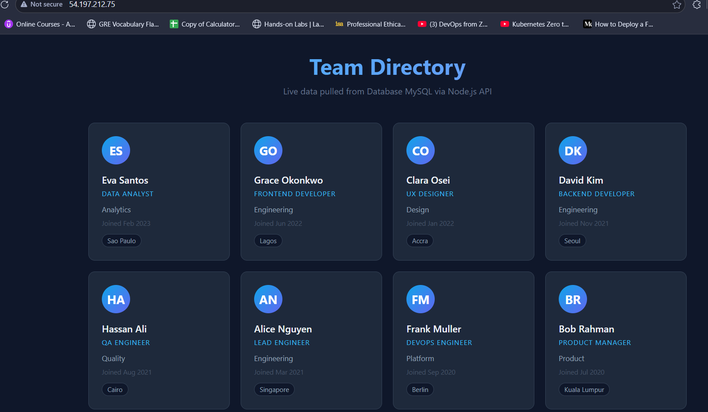

### 2. Back-End API
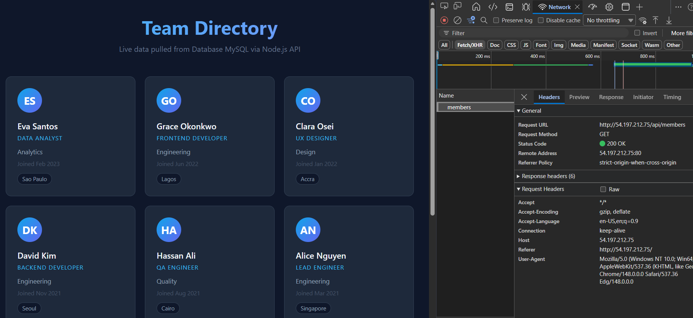

### 3. DataBase URL
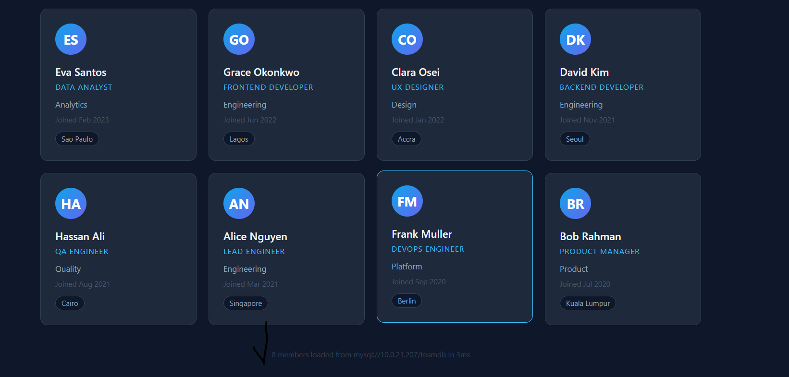

### 4. Terraform Outputs
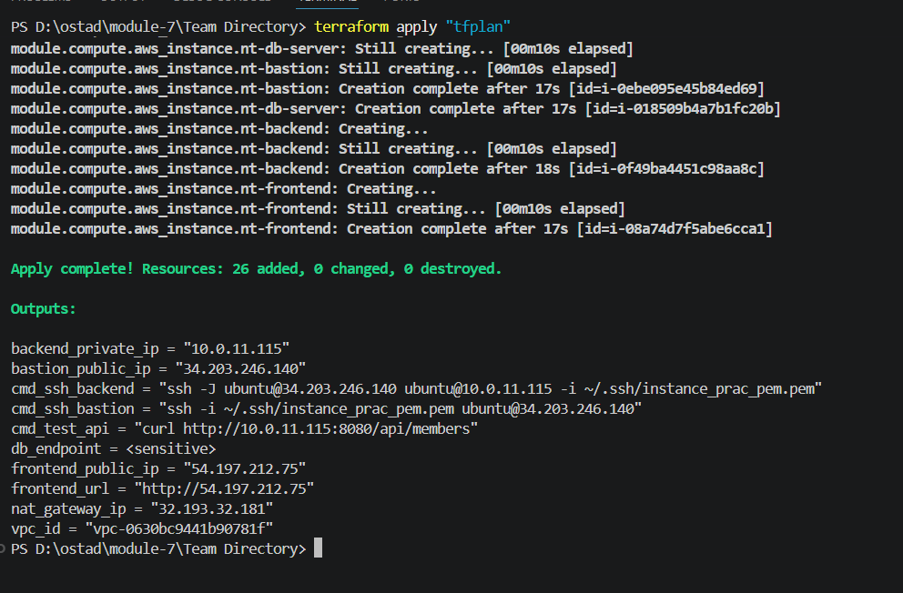

### 5. Pipeline Fail - Permission Denied
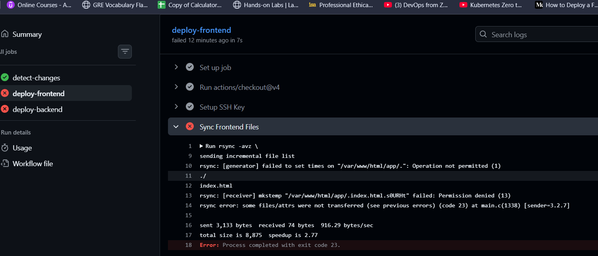

### 6. Pipeline Fixed - Permission Given
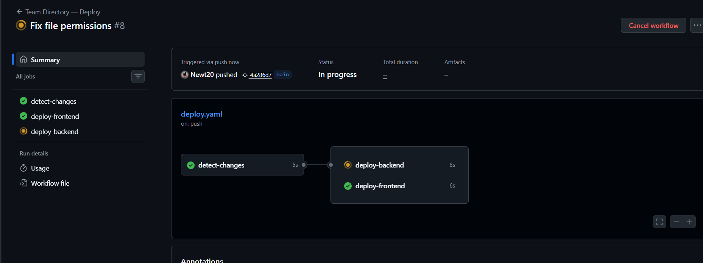

### 7. Deployed
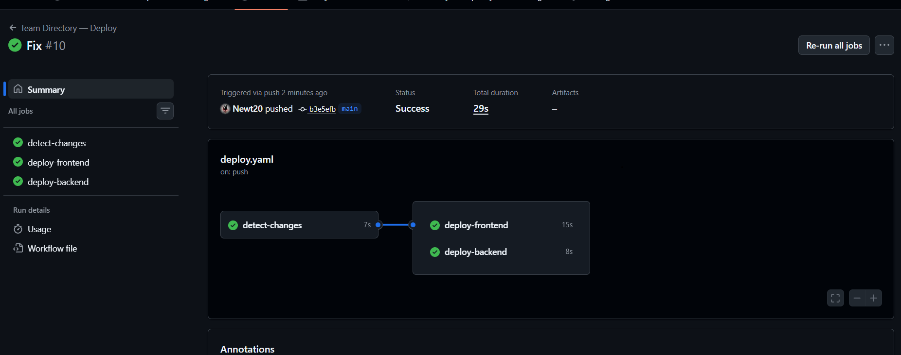

### 8. BackEnd Deploy - packageJson fixed
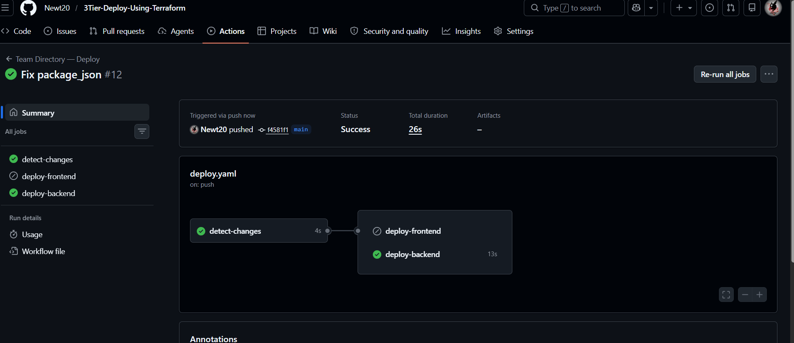

### 9. Post Pipeline Deployment
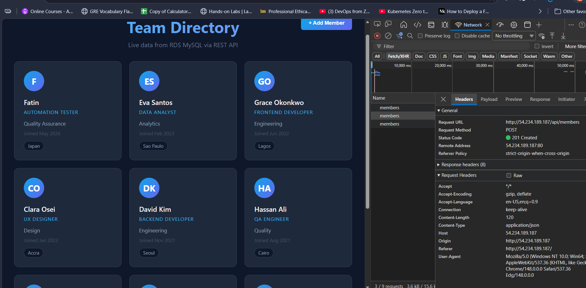

---


## 🖼️ Architecture Diagram

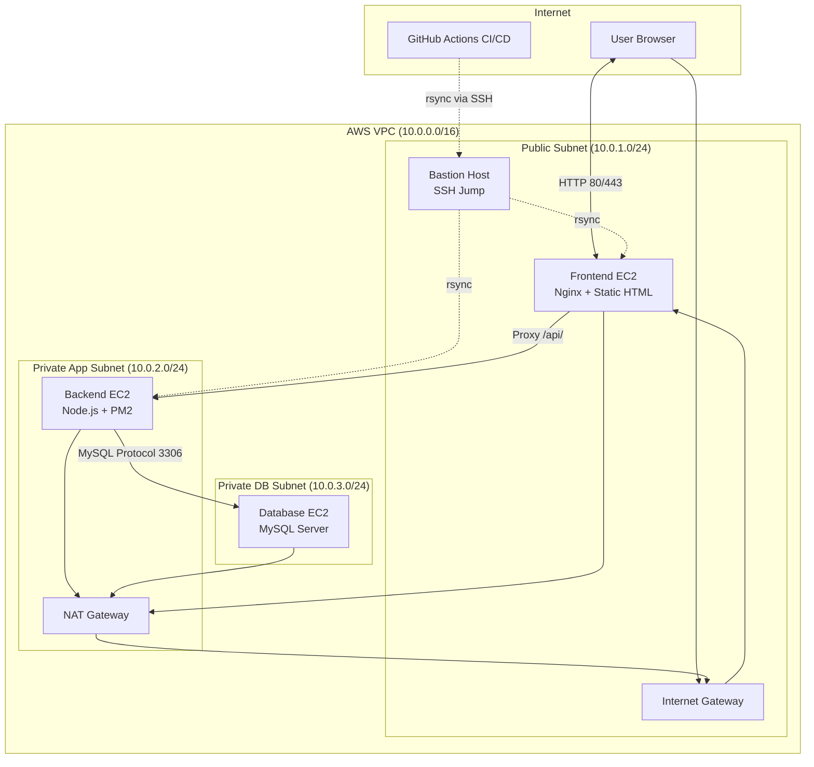

## 🔐 Security Group Relationships

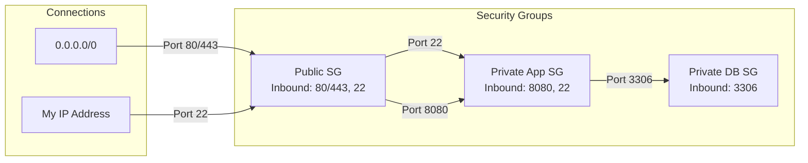
